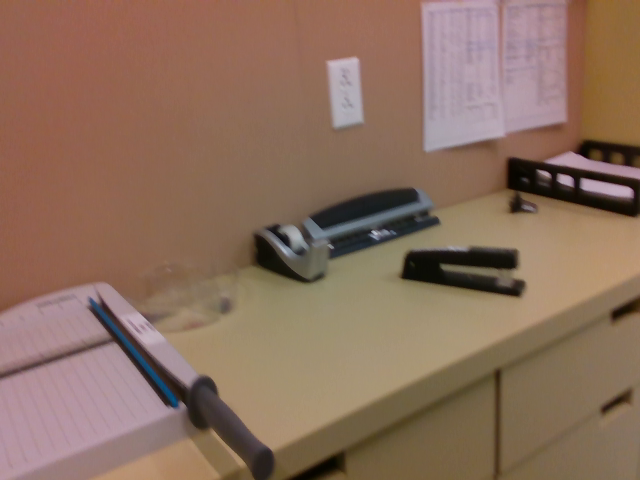
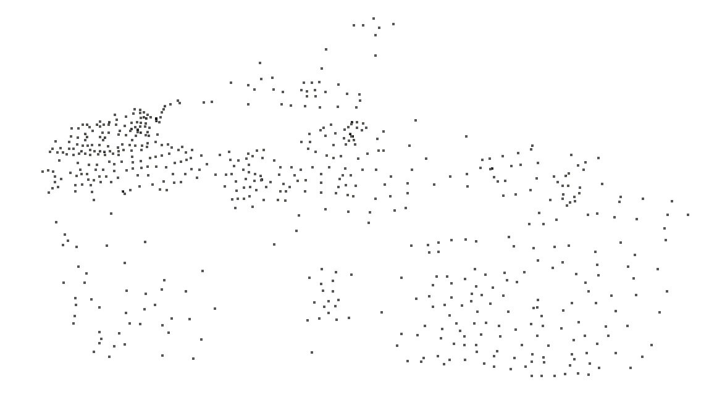
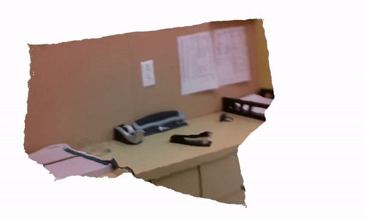
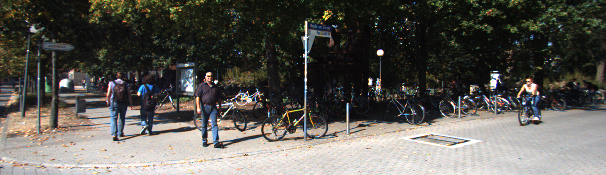
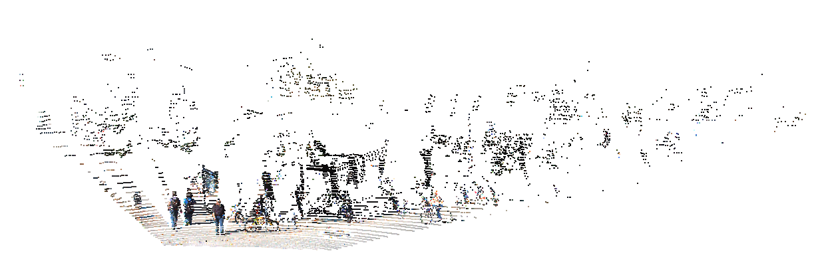
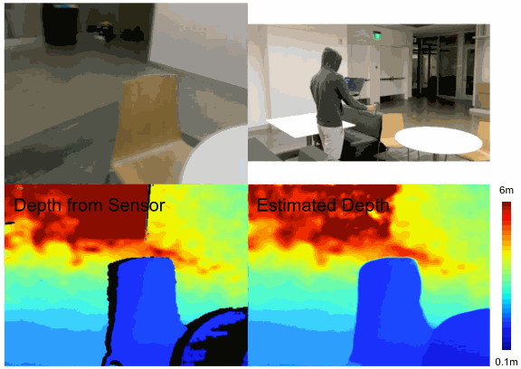

# Monitored Distillation for Positive Congruent Depth Completion (MonDi)

PyTorch implementation of *Monitored Distillation for Positive Congruent Depth Completion*

Published in the proceedings of ECCV 2022

[[publication]]() [[arxiv]](https://arxiv.org/pdf/2203.16034.pdf) [[poster]](https://drive.google.com/file/d/1P97f4ltZc02NI7-jKA3wYLLoIgKqqbU9/view?usp=sharing) [[talk]](https://drive.google.com/file/d/10vNcfTa-tLXVvm7xgj81SGuYpftGwJfE/view?usp=sharing)

Model have been tested on Ubuntu 20.04 using Python 3.7, 3.8,  PyTorch 1.7.1, (CUDA 10.1), 1.9.1 (CUDA 11.1)


Authors: [Tian Yu Liu](https://www.linkedin.com/in/tian-yu-liu), [Parth Agrawal](https://agrawalparth10.github.io/), [Allison Chen](https://allisonchen.us/), [Byung-Woo Hong](https://www.image.cau.ac.kr/people/director), [Alex Wong](https://www.cs.yale.edu/homes/wong-alex/)

If this work is useful to you, please cite our paper:

```
@inproceedings{liu2022monitored,
  title={Monitored distillation for positive congruent depth completion},
  author={Liu, Tian Yu and Agrawal, Parth and Chen, Allison and Hong, Byung-Woo and Wong, Alex},
  booktitle={European Conference on Computer Vision},
  pages={35--53},
  year={2022},
  organization={Springer}
}
```

**Table of Contents**
1. [About sparse-to-dense depth completion](#about-sparse-to-dense)
2. [About Monitored Distillation (MonDi)](#about-monitored-distillation)
3. [Setting up your virtual environment](#set-up-virtual-environment)
5. [Setting up your datasets](#set-up-datasets)
4. [Setting up your teacher models](#set-up-teacher-models)
6. [Running Mondi](#running-mondi)
7. [Training MonDi](training-mondi)
8. [Related projects](#related-projects)
9. [License and disclaimer](#license-disclaimer)

## About sparse-to-dense depth completion <a name="about-sparse-to-dense"></a>
Given sparse point cloud and image, the goal is to infer the dense point cloud. The sparse point cloud can obtained either from computational methods such as SfM (Strcuture-from-Motion) or active sensors such as lidar or structured light sensors. Commonly, it is projected onto the image plane as a sparse depth map or 2.5D representation, in which case, methods in this domain predicts a dense depth map. Here are some examples of dense point clouds outputted by our method:


| *Image* | *Sparse Point Cloud* | *Output Point Cloud* |
| :-----: | :------------------: | :-----------------: |
|  |  |  |
|  |  |  |


To follow the literature and benchmarks for this task, you may visit:
[Awesome State of Depth Completion](https://github.com/alexklwong/awesome-state-of-depth-completion)

## About Monitored Distillation <a name="about-monitored-distillation"></a>

### Motivation:
With the rapid progress of deep learning, many pretrained models are available online. Knowledge distillation is an effective way to learn from these models ( teachers ) by distilling information to a target model (student). However, the ability to effectively distill knowledge hinges on the fact that we can choose good teachers to learn from. This is easy if ground truth is available as it can be used to evaluate each teacher. However, ground truth is often either unavailable or extremely difficult to obtain, such as in the case of depth estimation.
Specifically, we focus on the task of depth completion, which involves densifying a sparse point cloud through guidance from camera images, or multi-sensor fusion. Any attempt to extrapolate the missing depth values typically fails since the point cloud is too sparse. Point cloud densification is an ill-posed problem, meaning there is an infinite hypothesis space due to ambiguities such as scale. Thus, the output is dependent on prior assumptions, biases, or regularization. This can come from hand-crafted methods like local smoothness, synthetic data, or even pretrained models, etc. In this work, we leverage the abundance of pretrained models as teachers to distill these regularities.
Distilling teacher models is not a trivial task. Different teachers have various error modes. Taking a mean of the ensemble results in the union of the error modes. Instead, we envision selectively combining the ensemble of teachers such that we only distill from teachers that can correctly recover the 3D scene such that the distilled depth map is positive congruent, where the result has lower error than any individual teacher.

### Our Solution:

#### Use of geometric constraints as a validation criterion:
We propose to use geometric constraints of the observations as a validation criterion to evaluate the performance of each teacher. Given calibrated images captured from different views of the same scene and a synchronized sparse point cloud, we propose to measure the correctness of each pretrained model based on whether or not their predictions can generate the images and sparse point clouds observed. Specifically, we reconstruct a target view from other observed views via photometric reprojection and measure its reconstruction error w.r.t the target using SSIM, a structural similarity index. Additionally, we also measure the deviation of the predicted point cloud from the sparse range measurements. Using the image and point cloud reconstruction errors, we can compose predictions from the ensemble by selecting those that best minimize the errors. The result is the distilled depth map, which can be used to train a student model.

#### What happens if all teacher networks perform poorly?
To avoid distilling the error modes common to all teachers, we propose a function to “monitor” their performance. This monitor is manifested as an adaptive weighting scheme derived by interpreting the error map as a negative log-likelihood. Higher errors yield lower weights to limit the influence of the teachers and instead fall back on image and sparse point cloud reconstruction as unsupervised losses.

<center>

</center>

The figure above shows the outputs of 2 teacher models - ENet and KBNet. ENet has errors in the paper cutter and cabinet regions of the scene. Averaging over them will shift the correct prediction of KBNet towards incorrect ones due to errors introduced by ENet. Hence, distilling from ENet would introduce these errors into the downstream student model.
However, our method allows us to selectively combine the ensemble of teachers and avoid their error modes. Our student model avoids the highlighted error modes of ENET by selectively distilling from KBNet. We call this process <b>monitored distillation </b>.

Training with MonDi yields real-time depth completion systems as seen in the demo below:
<center>

</center>


## Setting up your virtual environment <a name="set-up-virtual-environment"></a>
We will create a virtual environment using virtualenv with dependencies for running our results.
```
virtualenv -p /usr/bin/python3.7 mondi-py37env
source mondi-py37env/bin/activate

export TMPDIR=./
```

For Nvidia GTX achitectures i.e. 10 series (CUDA 10.1)
```
pip install -r requirements-gtx.txt
pip install torch==1.7.1+cu101 torchvision==0.8.2+cu101 -f https://download.pytorch.org/whl/torch_stable.html
```

For Nvidia RTX achitectures i.e. 20 and 30 series (CUDA 11.1)
```
pip install -r requirements-rtx.txt
pip install torch==1.9.1+cu111 torchvision==0.10.1+cu111 -f https://download.pytorch.org/whl/torch_stable.html
```

## Setting up your datasets <a name="set-up-datasets"></a>


For datasets, we will use [KITTI][kitti_dataset] for outdoors and [VOID][void_github] for indoors. Below are instructions to run our setup script for each dataset. The setup script will (1) store images as sequential temporal triplets and (2) produce paths for training, validation and testing splits.
```
mkdir -p data
ln -s /path/to/kitti_raw_data data/
ln -s /path/to/kitti_depth_completion data/
ln -s /path/to/void_release data/
```

If you already have KITTI and VOID datasets, you can set them up using
```
python setup/setup_dataset_kitti.py
python setup/setup_dataset_void.py
```

In case you do not already have KITTI dataset downloaded, we provide download a scripts:
```
bash bash/setup_dataset_kitti.sh
```
For the KITTI dataset, the `bash/setup_dataset_kitti.sh` script will download and set up `kitti_raw_data` and `kitti_depth_completion` for you in your data folder.

For the VOID dataset, you may download them via:
```
https://drive.google.com/open?id=1kZ6ALxCzhQP8Tq1enMyNhjclVNzG8ODA
https://drive.google.com/open?id=1ys5EwYK6i8yvLcln6Av6GwxOhMGb068m
https://drive.google.com/open?id=1bTM5eh9wQ4U8p2ANOGbhZqTvDOddFnlI
```
which will give you three files `void_150.zip`, `void_500.zip`, `void_1500.zip`.

Assuming you are in the root of the repository, to construct the same dataset structure as the setup script above:
```
mkdir void_release
unzip -o void_150.zip -d void_release/
unzip -o void_500.zip -d void_release/
unzip -o void_1500.zip -d void_release/
bash bash/setup_dataset_void.sh unpack-only
```
If you encounter `error: invalid zip file with overlapped components (possible zip bomb)`. Please do the following
```
export UNZIP_DISABLE_ZIPBOMB_DETECTION=TRUE
```
and run the above again.

For more detailed instructions on downloading and using VOID and obtaining the raw rosbags, you may visit the [VOID][void_github] dataset webpage.


The above set up scripts will create the following directories
```
data/kitti_depth_completion_mondi
data/void_mondi
```
and store the paths to the training, validation and testing data as `.txt` files in
```
training/kitti
validation/kitti
testing/kitti
training/void
testing/void
```

## Setting up your teacher models  <a name="set-up-teacher-models"></a>
We will begin by setting up the teacher models (external models) using the pre-packaged code repositories in `external_src`.
```
python setup/setup_external_model_enet.py
python setup/setup_external_model_penet.py
python setup/setup_external_model_msg_chn.py
python setup/setup_external_model_kbnet.py
python setup/setup_external_model_scaffnet.py
python setup/setup_external_model_nlspn.py
```

On the KITTI dataset, we use NLSPN, ENet, PENet, and MSG-CHN. Run the following commands to download weights for each teacher on the respective dataset and generate the teacher outputs.

```
bash bash/setup/kitti/setup_dataset_kitti_teacher_output_enet-kitti.sh
bash bash/setup/kitti/setup_dataset_kitti_teacher_output_msg_chn-kitti.sh
bash bash/setup/kitti/setup_dataset_kitti_teacher_output_nlspn-kitti.sh
bash bash/setup/kitti/setup_dataset_kitti_teacher_output_penet-kitti.sh
```

On the VOID dataset, we use NLSPN, MSG-CHN, ENet, PENet, ScaffNet, KBNet, and FusionNet. Run the following commands to download weights for each teacher on the respective dataset and generate the teacher outputs.

```
bash bash/setup/void/setup_dataset_void_teacher_output_enet-void1500.sh
bash bash/setup/void/setup_dataset_void_teacher_output_fusionnet-void1500.sh
bash bash/setup/void/setup_dataset_void_teacher_output_kbnet-void1500.sh
bash bash/setup/void/setup_dataset_void_teacher_output_msg_chn-void1500.sh
bash bash/setup/void/setup_dataset_void_teacher_output_nlspn-void1500.sh
bash bash/setup/void/setup_dataset_void_teacher_output_penet-void1500.sh
bash bash/setup/void/setup_dataset_void_teacher_outputs_scaffnet-scenenet.sh
```

For some of our experiments, we generate teacher predictions using KBNet and FusionNet for VOID using teachers trained on a different dataset (NYU v2). To generate those teacher predictions, run the following:

```
bash bash/setup/void/setup_dataset_void_teacher_output_fusionnet-nyu_v2.sh
bash bash/setup/void/setup_dataset_void_teacher_output_kbnet-nyu_v2.sh
```

**Note**: if you have multiple GPUs, you may consider running the setup scripts above in parallel in multiple terminals i.e. setting `CUDA_VISIBLE_DEVICES=<GPU-id>`.

## Downloading pretrained models from our Model Zoo <a name="downloading-pretrained-models"></a>
To use our pretrained models trained on KITTI and VOID models, you can download them from Google Drive
```
gdown https://drive.google.com/uc?id=1Rz3Mq5hZ-jfK4rvku2onXVvWXfLTnsdQ
unzip pretrained_models.zip
```

Note: `gdown` fails intermittently and complains about permission. If that happens, you may also download the models via:
```
https://drive.google.com/file/d/1Rz3Mq5hZ-jfK4rvku2onXVvWXfLTnsdQ/view?usp=sharing
```

Once you unzip the file, you will find a directory called `pretrained_models` containing the following file structure:
```
pretrained_models
|---- kitti
      |---- posenet-kitti.pth
      |---- mondi-kitti.pth
|---- void
      |---- posenet-void1500-unsupervised.pth
      |---- mondi-void1500-unsupervised.pth
      |---- posenet-void1500-supervised.pth
      |---- mondi-void1500-supervised.pth
      |---- posenet-void1500-heterogeneous.pth
      |---- mondi-void1500-heterogeneous.pth
      |---- posenet-void1500-ood.pth
      |---- mondi-void1500-ood.pth
```

We also provide our PoseNet model that was trained jointly with our compressed Calibrated Backproject Network (KBNet) so that you may finetune on them without having to relearn pose from scratch.

The pretrained weights should reproduce the numbers we reported in our [paper](https://arxiv.org/pdf/2203.16034.pdf). The table below are the comprehensive numbers:

For KITTI:
| Evaluation set        | MAE    | RMSE    | iMAE  | iRMSE |
| :-------------------- | :----: | :-----: | :---: | :---: |
| Validation            | 218.222 | 815.157  |  0.91  | 2.184  |
| Testing      | 218.60 | 785.06 | 0.92 | 2.11 |

For VOID1500:
| Teacher ensemble type           | MAE    | RMSE    | iMAE  | iRMSE  |
| :----------------------- | :----: | :-----: | :---: | :----: |
| Heterogeneous | 29.67 | 79.78 | 14.84 | 37.88 |
| Supervised | 30.88  | 87.48  | 15.31 |  38.33  |
| Unsupervised | 36.42 | 87.78 | 19.18 | 43.83 |
| Out-of-domain |  46.66 | 104.05 | 26.13 | 54.96 |

## Running MonDi <a name="running-mondi"></a>
To run our pretrained model on the KITTI validation set, you may use
```
bash bash/run/kitti/run_mondi_kitti.sh
```

Our run scripts will log all of the hyper-parameters used as well as the evaluation scores based on the output_path argument. The expected output should be:
```
     MAE      RMSE      iMAE     iRMSE
 218.222   815.157     0.910     2.184
     +/-       +/-       +/-       +/-
  75.214   271.234     0.239     1.089
```

To run our pretrained model on the VOID-1500 (density 0.5%) validation set, you may use
```
bash bash/run/void/run_mondi_void-void.sh
```

The expected output should be:
```
     MAE      RMSE      iMAE     iRMSE
  29.666    79.775    14.838    37.875
     +/-       +/-       +/-       +/-
  20.240    60.561    16.213    45.596
```
Note that you can also run VOID-150 and VOID-500 by corresponding changing the `DENSITY` variable in the bash script.

To run pretrained teacher models on the KITTI/VOID dataset, you may respectively use
```
bash bash/run/kitti/run_{kbnet|enet|msg_chn|nlspn|penet}_model_kitti.sh
bash bash/run/void/run_{enet|scaffnet|fusionnet|kbnet|msg_chn|nlspn|penet}_model_void.sh
```

We also provide our model trained on out-of-domain teachers. You can run our model using
```
bash bash/run/void/run_mondi_void-nyuv2_scenenet.sh
```
and their corresponding teachers using
```
bash bash/run/void/run_kbnet_model_void-nyu_v2.sh
bash bash/run/void/run_fusionnet_model_nyu_v2.sh
```

## Training Mondi<a name="training-mondi"></a>
To train MonDi on the KITTI dataset, you may run
```
bash bash/train/train_mondi_kitti.sh
```
To train MonDi on the VOID dataset for the heterogeneous and out-of-domain settings, you may respectively run
```
bash bash/train/train_mondi_void.sh
bash bash/train/train_mondi_void_nyuv2_scenenet.sh
```

Note that while we do not train on VOID 500 or 150 (hence no hyper-parameters are provided), if interested you may modify the training paths to train on VOID 500:
```
--train_image_path training/void/void_train_image_500.txt \
--train_sparse_depth_path training/voidvoid_train_sparse_depth_500.txt \
--train_intrinsics_path training/void/void_train_intrinsics_500.txt \
```
and on VOID 150:
```
--train_image_path training/void/void_train_image_150.txt \
--train_sparse_depth_path training/void/void_train_sparse_depth_150.txt \
--train_intrinsics_path training/void/void_train_intrinsics_150.txt \
```
To monitor your training progress, you may use Tensorboard
```
tensorboard --logdir trained_mondi/kitti/mondi_model
tensorboard --logdir trained_mondi/void1500/mondi_model
```
## Related projects <a name="related-projects"></a>
You may also find the following projects useful:

- [KBNet][kbnet_github]: *Unsupervised Depth Completion with Calibrated Backprojection Layers*. A fast (15 ms/frame) and accurate unsupervised sparse-to-dense depth completion method that introduces a calibrated backprojection layer that improves generalization across sensor platforms. This work is published as an oral paper in the International Conference on Computer Vision (ICCV) 2021.
- [ScaffNet][scaffnet_github]: *Learning Topology from Synthetic Data for Unsupervised Depth Completion*. An unsupervised sparse-to-dense depth completion method that first learns a map from sparse geometry to an initial dense topology from synthetic data (where ground truth comes for free) and amends the initial estimation by validating against the image. This work is published in the Robotics and Automation Letters (RA-L) 2021 and the International Conference on Robotics and Automation (ICRA) 2021.
- [AdaFrame][adaframe_github]: *An Adaptive Framework for Learning Unsupervised Depth Completion*. An adaptive framework for learning unsupervised sparse-to-dense depth completion that balances data fidelity and regularization objectives based on model performance on the data. This work is published in the Robotics and Automation Letters (RA-L) 2021 and the International Conference on Robotics and Automation (ICRA) 2021.
- [VOICED][voiced_github]: *Unsupervised Depth Completion from Visual Inertial Odometry*. An unsupervised sparse-to-dense depth completion method, developed by the authors. The paper introduces Scaffolding for depth completion and a light-weight network to refine it. This work is published in the Robotics and Automation Letters (RA-L) 2020 and the International Conference on Robotics and Automation (ICRA) 2020.
- [VOID][void_github]: from *Unsupervised Depth Completion from Visual Inertial Odometry*. A dataset, developed by the authors, containing indoor and outdoor scenes with non-trivial 6 degrees of freedom. The dataset is published along with this work in the Robotics and Automation Letters (RA-L) 2020 and the International Conference on Robotics and Automation (ICRA) 2020.
- [XIVO][xivo_github]: The Visual-Inertial Odometry system developed at UCLA Vision Lab. This work is built on top of XIVO. The VOID dataset used by this work also leverages XIVO to obtain sparse points and camera poses.
- [GeoSup][geosup_github]: *Geo-Supervised Visual Depth Prediction*. A single image depth prediction method developed by the authors, published in the Robotics and Automation Letters (RA-L) 2019 and the International Conference on Robotics and Automation (ICRA) 2019. This work was awarded **Best Paper in Robot Vision** at ICRA 2019.
- [AdaReg][adareg_github]: *Bilateral Cyclic Constraint and Adaptive Regularization for Unsupervised Monocular Depth Prediction.* A single image depth prediction method that introduces adaptive regularization. This work was published in the proceedings of Conference on Computer Vision and Pattern Recognition (CVPR) 2019.

We also have works in adversarial attacks on depth estimation methods and medical image segmentation:
- [SUPs][sups_github]: *Stereoscopic Universal Perturbations across Different Architectures and Datasets..* Universal advesarial perturbations and robust architectures for stereo depth estimation, published in the Proceedings of Computer Vision and Pattern Recognition (CVPR) 2022.
- [Stereopagnosia][stereopagnosia_github]: *Stereopagnosia: Fooling Stereo Networks with Adversarial Perturbations.* Adversarial perturbations for stereo depth estimation, published in the Proceedings of AAAI Conference on Artificial Intelligence (AAAI) 2021.
- [Targeted Attacks for Monodepth][targeted_attacks_monodepth_github]: *Targeted Adversarial Perturbations for Monocular Depth Prediction.* Targeted adversarial perturbations attacks for monocular depth estimation, published in the proceedings of Neural Information Processing Systems (NeurIPS) 2020.
- [SPiN][spin_github] : *Small Lesion Segmentation in Brain MRIs with Subpixel Embedding.* Subpixel architecture for segmenting ischemic stroke brain lesions in MRI images, published in the Proceedings of Medical Image Computing and Computer Assisted Intervention (MICCAI) Brain Lesion Workshop 2021 as an **oral paper**.

[kitti_dataset]: http://www.cvlibs.net/datasets/kitti/
[nyu_v2_dataset]: https://cs.nyu.edu/~silberman/datasets/nyu_depth_v2.html
[void_github]: https://github.com/alexklwong/void-dataset
[voiced_github]: https://github.com/alexklwong/unsupervised-depth-completion-visual-inertial-odometry
[scaffnet_github]: https://github.com/alexklwong/learning-topology-synthetic-data
[adaframe_github]: https://github.com/alexklwong/adaframe-depth-completion
[kbnet_github]: https://github.com/alexklwong/calibrated-backprojection-network
[xivo_github]: https://github.com/ucla-vision/xivo
[geosup_github]: https://github.com/feixh/GeoSup
[adareg_github]: https://github.com/alexklwong/adareg-monodispnet
[sups_github]: https://github.com/alexklwong/stereoscopic-universal-perturbations
[stereopagnosia_github]: https://github.com/alexklwong/stereopagnosia
[targeted_attacks_monodepth_github]: https://github.com/alexklwong/targeted-adversarial-perturbations-monocular-depth
[spin_github]: https://github.com/alexklwong/subpixel-embedding-segmentation

## License and disclaimer <a name="license-disclaimer"></a>
This software is property of the UC Regents, and is provided free of charge for research purposes only. It comes with no warranties, expressed or implied, according to these [terms and conditions](license). For commercial use, please contact [UCLA TDG](https://tdg.ucla.edu).
